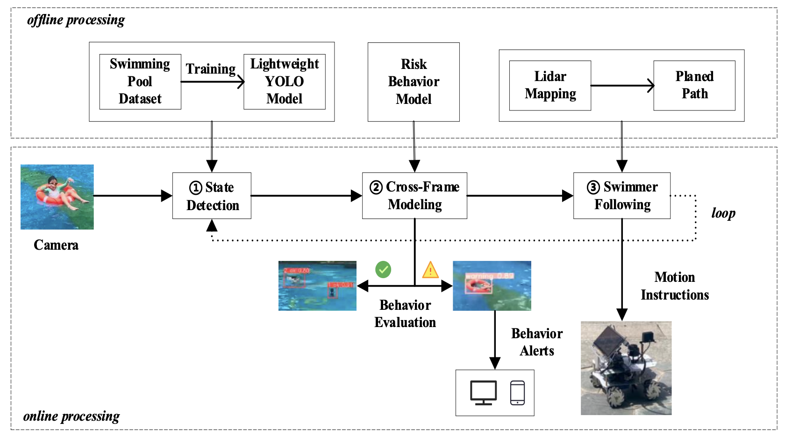

# Project Overview

This project follows the idea of "**target detection → target tracking → state modeling → behavior warning**". It begins by utilizing a swimming pool dataset, including homemade live video. The data is labeled to train both the target detection network model based on deep learning and the fast target detection model based on optimized YOLO. Please note that the dataset is not included in this repository; if needed, please contact us for access. The optimization efforts are focused on lightweight scenes, incorporating the EIOU loss function, ACON-C activation function, Ghostnet, BiFPN feature fusion, and the coordinate attention mechanism (CA). The optimization results are evaluated through a comparative analysis of three network models (Baseline, Ghostnet+, BiFPN+CA).

## Project Structure

The project structure is organized as follows:

- **`data/`**: Contains the swimming pool dataset (not included).
- **`models/`**: Holds the trained models and their variations. (not included)
- **`sourcecode/`**: Source code for target detection, tracking, state modeling, and behavior warning.


## Getting Started

1. **Clone the Repository:**
   ```bash
   git clone https://github.com/UserEdmund/SwimmingPool.git

# This project is based on Yolov5 + DeepSORT 

The baseline YoloV5 repo is forked from  https://github.com/ultralytics/yolov5/

The baseline DeepSORT repo is forked from  https://github.com/mikel-brostrom/Yolov5_StrongSORT_OSNet

For Yolov5 DeepSort OSNet bugs and feature requests please visit [GitHub Issues](https://github.com/mikel-brostrom/Yolov5_StrongSORT_OSNet/issues). For business inquiries or professional support requests please send an email to: yolov5.deepsort.pytorch@gmail.com

### Architecture of the Project



### Demo Video

 

The created from a source online. Source: https://finance.sina.com.cn/jjxw/2023-10-09/doc-imzqpeci4661742.shtml


## Contributors

- [Hongyi Qi](https://github.com/UserEdmund)


## License

This project is licensed under the [GPL-3.0 License](LICENSE).


