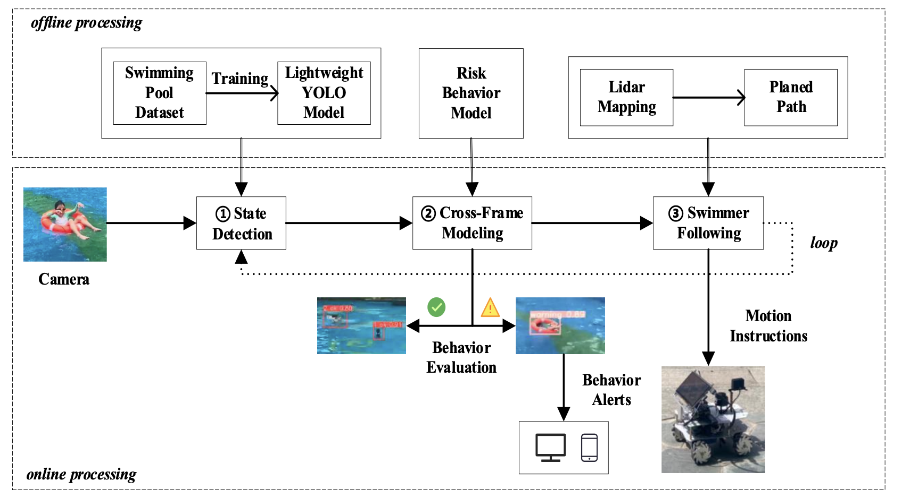

# Weather Parameter Addition, Radar Mapping Tests, and ROS Robot Code

## Overview

This folder contains code related to three main components:

1. **Weather Parameter Addition**
   - Code for integrating weather information as a parameter in your application.

2. **Radar Mapping Test Graphs**
   - Test graphs for radar mapping functionality, providing visualizations for testing and analysis.

3. **ROS Robot Code**
   - Codebase related to the Robot Operating System (ROS) for controlling and interacting with a robot.

## Contents

### Architecture of the Project



### 1. Weather Parameter Addition

The `weather_parameter_addition` directory contains the code for adding weather as a parameter to your application. This feature allows you to dynamically incorporate weather data into your processes. Refer to the documentation or source files within this directory for implementation details.

### 2. Radar Mapping Test Graphs

The `radar_mapping_tests` directory includes code and data files for generating test graphs related to radar mapping. These graphs are useful for assessing the performance and accuracy of radar mapping algorithms. Explore the documentation within this directory for instructions on running tests and interpreting results.

### 3. ROS Robot Code

The `ros_robot_code` directory houses code for working with the Robot Operating System (ROS). This code includes modules for controlling various aspects of a robot, interfacing with sensors, and executing specific tasks. Refer to the documentation in this directory for setup instructions and usage guidelines.

## Getting Started

To use the code in this repository, follow these general steps:

1. Clone this repository to your local machine:

    ```bash
    git clone https://github.com/UserEdmund/SwimmingPool.git
    ```

2. Navigate to the specific directories of interest (`weathertest.py`, `robot.py`, or `pc.py`).


## Contributors

- [Hongyi Qi](https://github.com/UserEdmund)


## License

This project is licensed under the [GPL-3.0 License](LICENSE).